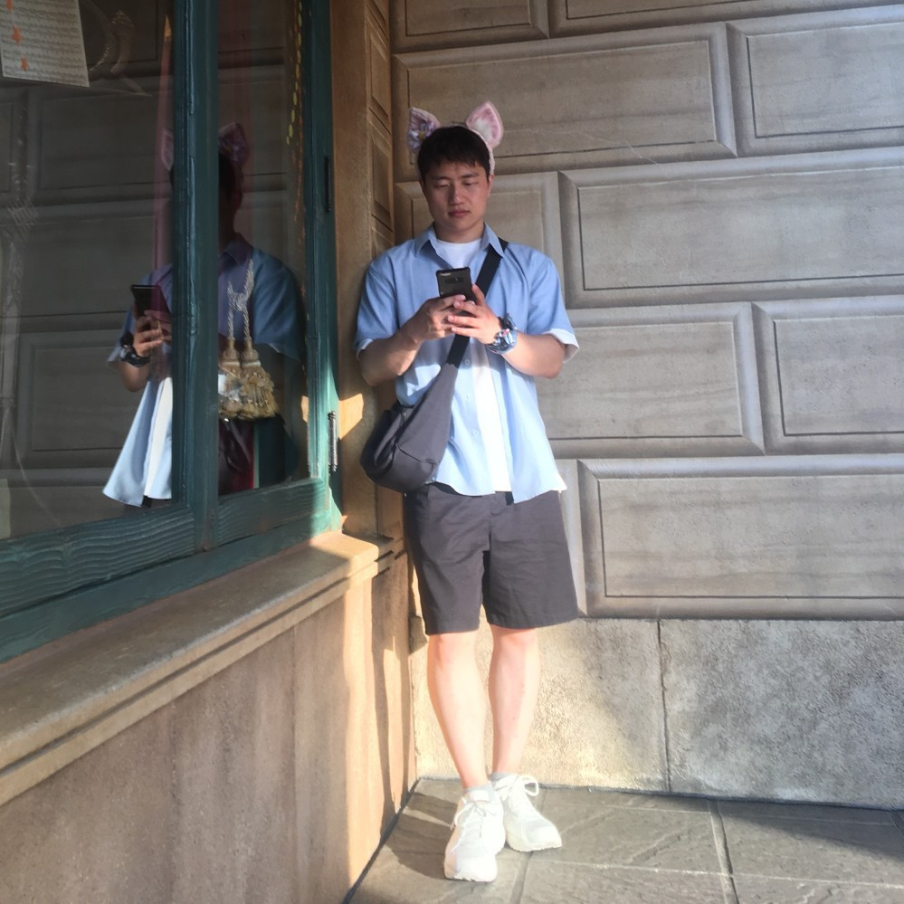

  
  

    <h1>DaeYong Kim</h1>
    

      Hi, I'm <strong>DaeYong Kim</strong>. I'm a MS student at 
      <strong>Ajou University</strong>, advised by <strong>Prof. Ri Yu</strong>.
      I focus on <strong>Computer Graphics</strong> such as 
      <strong>motion capture, human-scene interaction, etc.</strong>
    

    
contact: {{site.email}}

    

      <a href="https://github.com/DaeeYong/" class="btn">GitHub</a>
      <a href="http://cgldragon.com/" class="btn">Blog</a>
    

  

<section class="updates">
  <h2>Updates</h2>
  <ul>
    <li><strong>Mar 2023</strong>: Our paper accepted to MDS2024 🎉</li>
    <li><strong>Jan 2023</strong>: Joined Computer Graphics Labs as a undergraduate research intern</li>
    <li><strong>Jul 2022</strong>: Joined Visual Computing Labs as a undergraduate research intern</li>
  </ul>
</section>

<section id="educations">
  <h2>Educations</h2>
  
</section>

<section id="experiments">
  <h2>Experiments</h2>
  
</section>

<section id="publications">
  <h2>Publications</h2>
  
</section>

<section id="projects">
  <h2>Projects</h2>
  
</section>

<section id="seminars">
  <h2>Seminars</h2>
  
</section>
